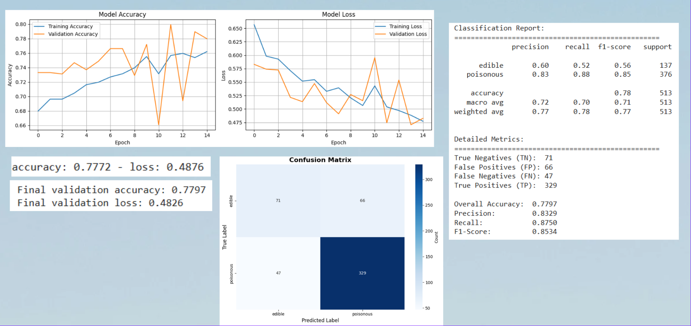
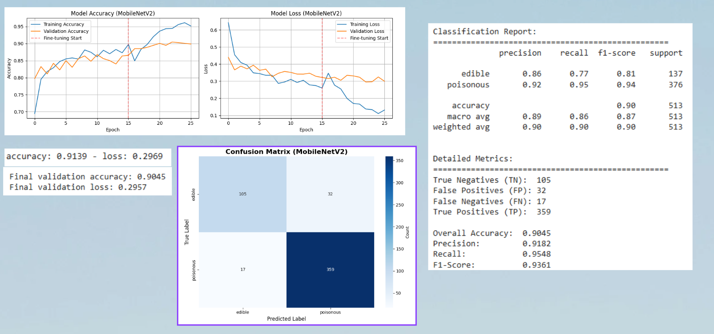

```
======================================================================
UVA 4774 final project team 30 : Detecting poisonous mushrooms using machine learning techniques.

Ruixin Duan Jinghan Zhang Isabella Liu

12/17/2025
======================================================================
```

## Overview
In this repository, we prepare everything that is needed to reproduce our results for the final project of CS4774 machine learning. In this project, we try to classify mushrooms into edible or poisonous with a focus on less false edible. Our goal is to build models that could predict the class of the mushrooms with 75% recall or above. To achieve that goal, we collected multiple datasets and train baseline CNN model and MobileNet model.

## Usage:
To run our code and get the results, make sure that you changed the directory of the dataprocessing.ipynb to your working directory. After processing the code, run other scripts to build models and see results.

## Setup:
The setup needed for this project can be done follow:

step 1: Install python of version 3.9-3.11. Run python --version to see if the version is proper.

step 2: Install dependencies: pip install -r requirements.txt


## Link to the video
待定


## Links to our data
https://www.kaggle.com/datasets/quanghn2001/image-mushroom-dataset?resource=download

https://www.kaggle.com/datasets/marcosvolpato/edible-and-poisonous-fungi/data

## Link to our slides 
https://www.canva.com/design/DAG5ecEw8XE/YwEtQcNrUhZ7R1tbytkU7Q/edit

## Problem/Topic
Identify whether a mushroom picture is toxic or edible.

## Project structure

```text
├── LICENSE.md           # MIT License
├── README.md          # Brief description about the project and the project structure.
├── team-30             # Contain all the scripts and data needed.
│         ├── src             # The subfolder that contains all the scripts we needed.
│           ├── DataProcessing.ipynb     # The code for data cleaning preprocessing, combining into a single dataset.
│           └── CNN.ipynb     # Our coding for CNN model.
|            └── Mobile.ipynb   # Our coding for MobileNet model.
|         ├── DATA
│           ├── original_data         # The subfolder that contained all the original data
|                  └──.......
│           └── Cleaned # The subfolder that contains all the cleaned combined data.
|                  └── Train.CSV
|                  └── Test.csv


```
## Project Motivation
There are many mushroom poisoning outbreaks because people can’t tell whether a mushroom is toxic. As a result we were interested in exploring how far a relatively simple convolutional neural network (CNN) or/and MLP can go in performing a task realted to plant species detection. 
Our motivation is to apply what we have learned in machine learning to address a meaningful real-world challenge. 
Worldwide, hundreds of people die each year from wild mushroom poisoning, and experts believe the actual number is higher due to underreporting. We think that this is because human visual identification is unreliable. So maybe machines can be trained on thousands of samples and give more accurate results.

## Result Analysis
Before optimization: simple CNN logic with 3 convolution layers performs a 48% accuracy rate overall.

After optimization: 



## Difficulties
Our model stucks at an accuracy rate of around 60%, which is not very good. Issues: There are biased/ insufficient data sets and an underfitting. The model cannot reach the optimum and we have a great gap between the training set and the testing set. 
In addition, the testing set is very different from the training set. Maybe that is the problem why we obtain a lower result than we originally expected it to be.